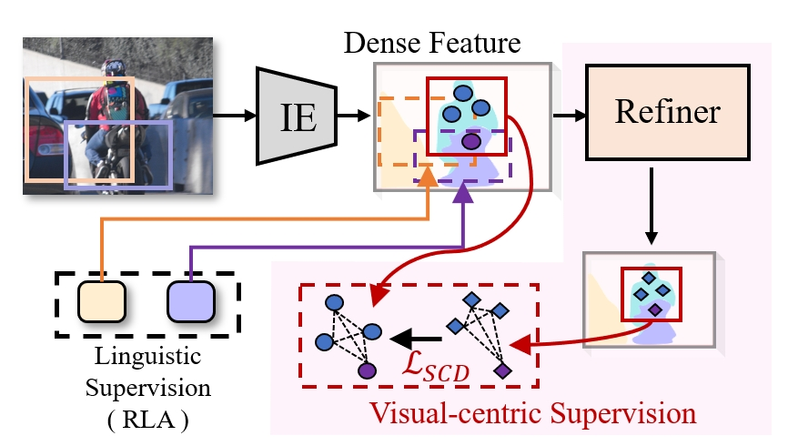

# Refining CLIP's Spatial Awareness: A Visual-centric Perspective
<div style="text-align: center;">
    
</div>

## TL;DR
We propose a refiner module that extracts dense, spatially-aware features directly from CLIP, enhancing region-language alignment with a visual-centric focus.


## Key Features 🔍
- **Refiner Architecture**: Refine CLIP's dense features through SSL pipeline for enhanced spatial sensitivity
- **SCD-Guidance**: Maintains region-language matching capabilities while adding spatial awareness
- **Model-Agnostic Design**: Verified effective on multiple CLIP variants

## Introduction
Official implementation of the paper **Refining CLIP's Spatial Awareness: A Visual-centric Perspective** (ICLR 2025).

> [**Refining CLIP's Spatial Awareness: A Visual-centric Perspective**](https://arxiv.org/abs/2504.02328)  
> Congpei Qiu, Yanhao Wu, Wei Ke, Xiuxiu Bai, Tong Zhang  
[[Project Page]](https://congpeiqiu.github.io/Refining/) • 
[[arXiv Paper]](https://arxiv.org/abs/2504.02328)

## TODO
- [ ] Release trained Refiner models and codes (MetaCLIP, EVA-CLIP)
- [ ] Release fine-tuned VLMs with Refiner integration
- [ ] Add SigLIP v2 support

## Training Refiner on Frozen VLMs

https://github.com/user-attachments/assets/92d8a37d-a643-402c-9b6d-7a6d1bba83af

<div align="center">
Training dynamics visualization of Refiner on EVA-CLIP</div>

*The code will be released soon, stay tuned!*

## Fine-tuning VLMs with Refiner
*The code will be released soon, stay tuned!*

## License
Released under [MIT License](LICENSE).

## Citation
```bibtex
@article{qiu2025refining,
  title={Refining CLIP's Spatial Awareness: A Visual-Centric Perspective},
  author={Qiu, Congpei and Wu, Yanhao and Ke, Wei and Bai, Xiuxiu and Zhang, Tong},
  journal={arXiv preprint arXiv:2504.02328},
  year={2025}
}
```


## Acknowledgement

Our code is based on [CLIPSelf](https://github.com/wusize/CLIPSelf) and closely related to [OpenCLIP](https://github.com/mlfoundations/open_clip/tree/v2.16.0), 
[EVA-CLIP](https://github.com/baaivision/EVA/tree/master/EVA-CLIP) and 
[MMDetection](https://github.com/open-mmlab/mmdetection/tree/v2.28.1). We sincerely thank them for their high-quality open source code!
